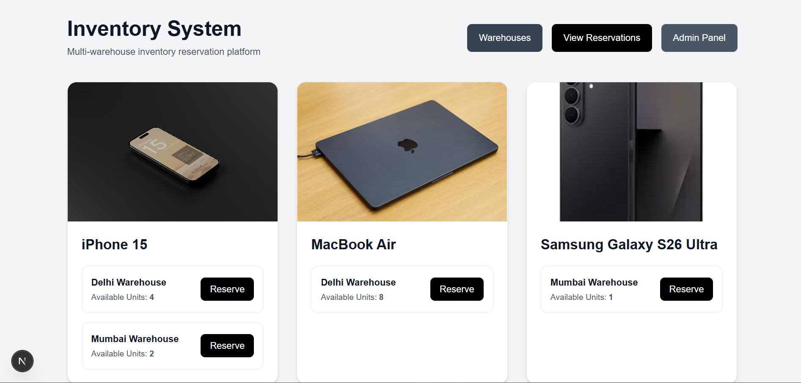
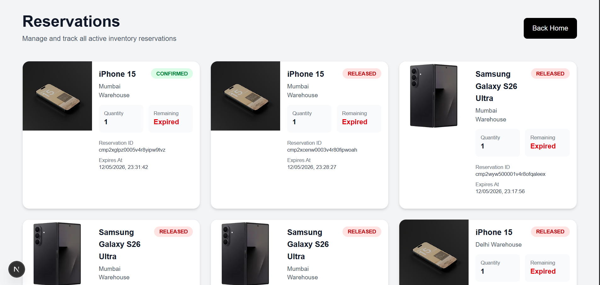
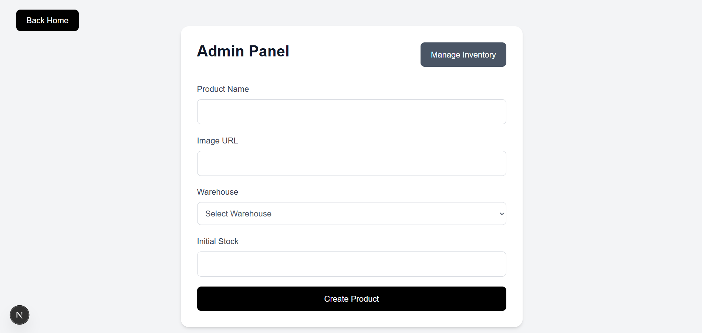
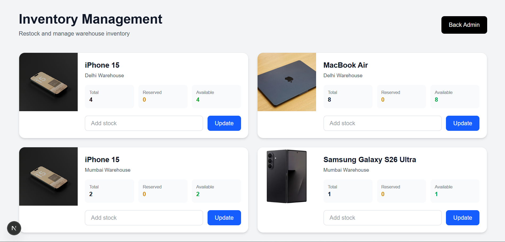
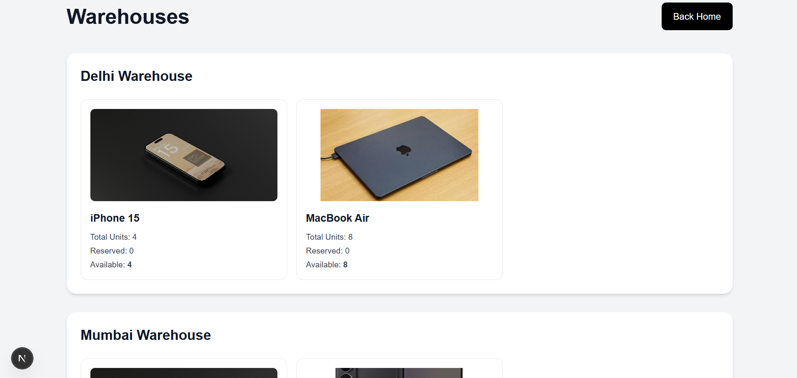

# Allo Inventory Reservation System

A multi-warehouse inventory reservation platform that is safe for concurrent use, developed with Next.js, Prisma ORM, PostgreSQL, and Supabase.

This system enables customers to make temporary reservations of inventory at the time of checkout, effectively preventing overselling during simultaneous purchase attempts.

---

# Live Demo

## Application URL

[https://allo-inventory-system-rlnb.vercel.app/](https://allo-inventory-system-rlnb.vercel.app/)

---

# Screenshots

## Homepage



---

## Reservation Flow



---

## Admin Product Management



---

## Inventory Management



---

## Warehouses



---

# Problem Statement

In real-world checkout systems, payment confirmation may take several minutes because of:

- UPI confirmation
- 3DS authentication
- wallet redirects
- payment retries

If inventory is decremented only after payment succeeds, multiple users can purchase the same final unit simultaneously.

This project solves that problem using temporary inventory reservations with automatic expiration and concurrency-safe stock locking.

---

# Features

## Customer Features

- Product listing page
- Multi-warehouse stock visibility
- Reserve inventory before checkout
- Live reservation countdown timer
- Confirm purchase
- Cancel reservation
- Automatic reservation expiration
- Real-time reservation state updates

---

## Admin Features

- Create products
- Add product images
- Manage warehouse inventory
- Restock existing inventory
- View warehouse inventory distribution

---

## System Features

- PostgreSQL row-level locking
- Concurrency-safe reservation system
- Automatic stock release on expiration
- Scheduled cleanup jobs
- Reservation retention policy
- Responsive UI
- Modal-based notifications
- Hosted PostgreSQL database

---

# Tech Stack

| Technology       | Purpose               |
| ---------------- | --------------------- |
| Next.js 16       | Frontend + API Routes |
| TypeScript       | Application language  |
| Prisma ORM       | Database ORM          |
| PostgreSQL       | Persistent storage    |
| Supabase         | Hosted database       |
| Tailwind CSS     | UI styling            |
| Vercel Cron Jobs | Scheduled cleanup     |
| Zod              | Request validation    |

---

# Architecture Overview

```text
                    ┌─────────────────────┐
                    │     Customer UI     │
                    └──────────┬──────────┘
                               │
                               ▼
                    ┌─────────────────────┐
                    │   Next.js API Layer │
                    └──────────┬──────────┘
                               │
                ┌──────────────┴──────────────┐
                ▼                             ▼
     ┌────────────────────┐      ┌────────────────────┐
     │ Reservation System │      │  Admin Management  │
     └──────────┬─────────┘      └──────────┬─────────┘
                │                           │
                ▼                           ▼
        ┌──────────────────────────────────────────┐
        │ PostgreSQL + Prisma Transactions         │
        │ Row-Level Locking (SELECT FOR UPDATE)    │
        └──────────────────────────────────────────┘
                               │
                               ▼
                  ┌─────────────────────┐
                  │ Scheduled Cron Jobs │
                  └─────────────────────┘
```

---

# Database Models

## Product

Represents products available for reservation.

## Warehouse

Represents physical warehouse locations.

## Inventory

Stores:

- total stock
- reserved stock
- product-to-warehouse mapping

## Reservation

Stores:

- reservation status
- expiry time
- reserved quantity

---

# Reservation Lifecycle

```text
Customer reserves product
            │
            ▼
Reservation created (PENDING)
            │
            ├──────────────► Confirm Purchase
            │                     │
            │                     ▼
            │             Status = CONFIRMED
            │
            └──────────────► Expiry / Cancel
                                  │
                                  ▼
                          Status = RELEASED
                                  │
                                  ▼
                      Reserved stock restored
```

---

# Concurrency Safety

The reservation endpoint is structured to be free from race conditions when accessed concurrently.

The system employs:

- PostgreSQL transactions
- Row-level locking (`SELECT ... FOR UPDATE`)
- Prisma transactional queries

This ensures:

- only one reservation is successful for the last available inventory unit
- conflicting requests are met with an HTTP 409 Conflict response
- overselling is effectively avoided

---

# Concurrency Validation

The concurrency behavior was evaluated through simultaneous reservation requests directed at an inventory that contained only a single available unit.

### Test Result

- 1 request succeeded (`201 Created`)
- 1 request failed (`409 Conflict`)
- inventory integrity remained correct

This validates the proper functioning of transactional locking behavior during concurrent access.

---

# Reservation Expiry & Cleanup

Reservations automatically expire after 10 minutes. The system uses a two-tier cleanup strategy:

### 1. Lazy Release (on Read)
Whenever a user fetches the product listing via `GET /api/products`, the system automatically detects and releases any expired `PENDING` reservations. This ensures that stock is returned to the available pool immediately when it's most needed.

### 2. Scheduled Record Purging (Cron)
A scheduled Vercel Cron Job operates daily to purge old reservation records from the database. This prevents the database from growing indefinitely on free-tier hosting:
- `RELEASED` reservations older than 1 day are deleted.
- `CONFIRMED` reservations older than 7 days are deleted.

---


---

# API Endpoints

| Method | Endpoint                        | Description              |
| ------ | ------------------------------- | ------------------------ |
| GET    | `/api/products`                 | List products with stock |
| GET    | `/api/warehouses`               | List warehouses          |
| POST   | `/api/reservations`             | Create reservation       |
| POST   | `/api/reservations/:id/confirm` | Confirm reservation      |
| POST   | `/api/reservations/:id/release` | Release reservation      |
| PATCH  | `/api/admin/inventory`          | Restock inventory        |
| POST   | `/api/admin/products`           | Create products          |

---

# Local Setup

## 1. Clone Repository

```bash
git clone https://github.com/GaneshRagolu001/allo-inventory-system
cd allo-inventory-system
```

---

## 2. Install Dependencies

```bash
npm install
```

---

## 3. Configure Environment Variables

Create `.env`

```env
DATABASE_URL=your_pooling_database_url
DIRECT_URL=your_direct_database_url
```

---

## 4. Generate Prisma Client

```bash
npx prisma generate
```

---

## 5. Push Database Schema

```bash
npx prisma db push
```

---

## 6. Seed Database

```bash
npx prisma db seed
```

---

## 7. Start Development Server

```bash
npm run dev
```

---

# Deployment

The application is designed for deployment using:

- Vercel (Frontend + API Routes + Cron Jobs)
- Supabase PostgreSQL

Cron jobs are configured through:

```text
vercel.json
```

---

# Trade-offs and Future Improvements

## Trade-offs

### No Authentication

The decision to exclude authentication was made to prioritize the development of the inventory reservation system and ensure concurrency correctness.

### Polling Instead of WebSockets

Currently, reservation updates are implemented using lightweight polling rather than real-time sockets, which simplifies the process.

### Cron-Based Expiry Cleanup

The cleanup of reservations may experience a slight delay based on the frequency of cron jobs, a trade-off deemed acceptable for this implementation.

---

## Future Improvements

- Implementation of authentication and role-based access control
- Development of search and filtering capabilities
- Introduction of real-time inventory updates
- Utilization of Redis for distributed locking
- Support for Idempotency-Key
- Creation of an analytics dashboard
- Establishment of audit logging
- Facilitation of inventory transfers between warehouses


---

# Key Engineering Focus Areas

This project primarily concentrated on:

- ensuring correctness in concurrent environments
- maintaining transactional integrity
- managing a clean reservation lifecycle
- developing operational cleanup strategies
- establishing a clear system architecture
- creating a maintainable code structure

---

# Author

Ganesh Ragolu
